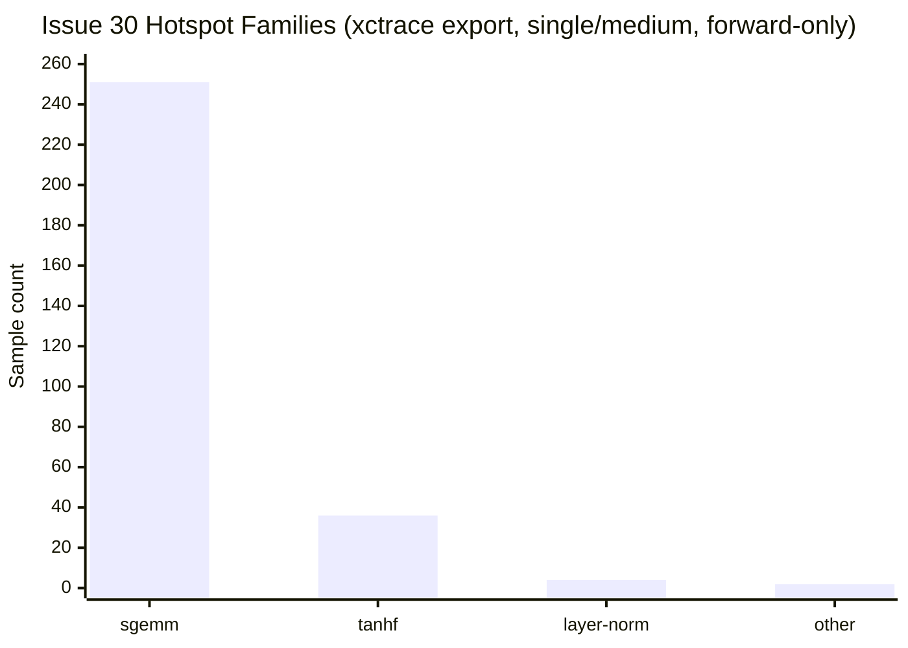
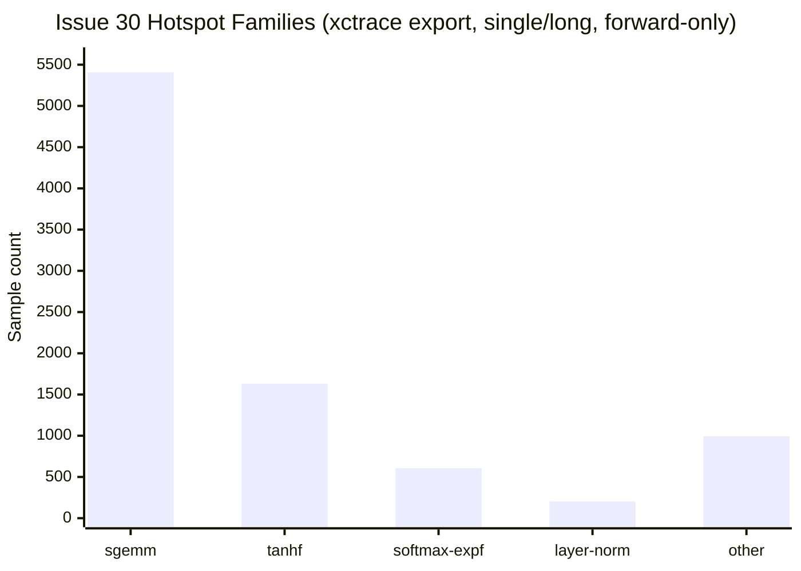
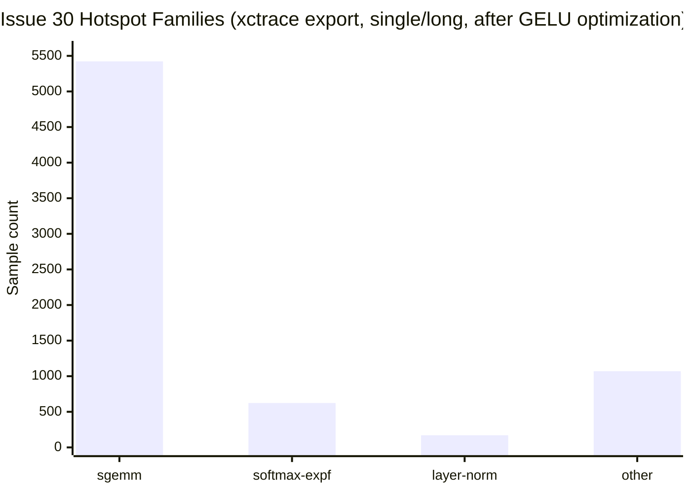
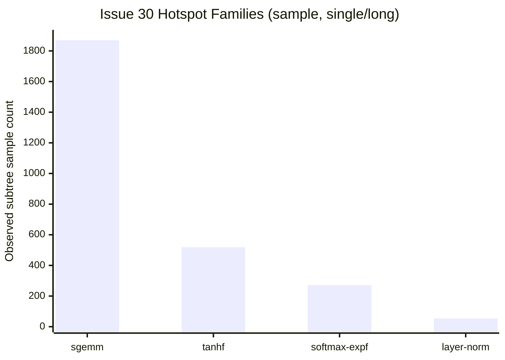

# Issue 30 Profiling Notes

## Scope

This note captures the reproducible profiling and benchmark workflow used for issue `#30` on macOS ARM64, plus the current hotspot summary after adding the fused masked-softmax path.

## Representative Commands

### Warm benchmark, all scenarios

Baseline workspace:

```bash
cargo run --release --bin benchmark_ltembed -- \
  --mode warm \
  --model-dir assets \
  --warmup 10 \
  --iters 30
```

Worktree under active development:

```bash
cargo run --release --bin benchmark_ltembed -- \
  --mode warm \
  --model-dir /Users/ruoshi/code/github/LTEmbed/assets \
  --warmup 10 \
  --iters 30
```

### Warm benchmark, single scenario

```bash
cargo run --release --bin benchmark_ltembed -- \
  --mode warm \
  --scenario single/medium \
  --model-dir /Users/ruoshi/code/github/LTEmbed/assets \
  --warmup 10 \
  --iters 30
```

This single-scenario mode is the new profiling-oriented entrypoint added in this change.

### Warm benchmark, mixed-length padded batch

```bash
cargo run --release --bin benchmark_ltembed -- \
  --mode warm \
  --scenario batch/mixed/8 \
  --model-dir /Users/ruoshi/code/github/LTEmbed/assets \
  --warmup 5 \
  --iters 20
```

This scenario intentionally mixes short, medium, and long texts in one batch so the engine has to exercise suffix-padding attention masks.

### Text hotspot summary with `sample`

```bash
target/release/benchmark_ltembed \
  --mode warm \
  --scenario single/long \
  --model-dir /Users/ruoshi/code/github/LTEmbed/assets \
  --warmup 5 \
  --iters 200 >/tmp/issue30-bench.json &

pid=$!
sample "$pid" 5 -mayDie -file /tmp/issue30-sample.txt
wait "$pid"
```

The `sample` output remains a useful fallback for longer runs and for text-first hotspot inspection.

### macOS `xctrace` trace artifact

Successful record:

```bash
xcrun xctrace record \
  --template 'Time Profiler' \
  --output /tmp/issue30-single-medium.trace \
  --time-limit 5s \
  --launch -- \
  target/release/benchmark_ltembed \
    --mode warm \
    --scenario single/medium \
    --model-dir /Users/ruoshi/code/github/LTEmbed/assets \
    --warmup 1 \
    --iters 10
```

Successful export:

```bash
xcrun xctrace export \
  --input /tmp/issue30-single-medium.trace \
  --xpath '/trace-toc/run[@number="1"]/data/table[@schema="time-profile"]' \
  --output /tmp/issue30-single-medium-time-profile.xml
```

Artifacts:

- trace bundle: `/tmp/issue30-single-medium.trace`
- exported time-profile XML: `/tmp/issue30-single-medium-time-profile.xml`
- long-run `sample` fallback: `/tmp/issue30-sample.txt`
- long-run benchmark JSON: `/tmp/issue30-bench.json`

## Current Benchmark Evidence

The main comparison from the full warm run:

| Scenario | Baseline mean ms | Current mean ms | Delta |
|---|---:|---:|---:|
| `single/long` | 296.349 | 290.976 | `-1.81%` |
| `single/medium` | 23.666 | 23.877 | `+0.89%` |
| `batch/medium/8` | 105.074 | 113.437 | noisy / regressed in this run |

Interpretation:

- the fused masked-softmax change shows a measurable win on the longer sequence path where attention score post-processing is amplified
- the shorter and batched scenarios were noisier on this machine and should be re-measured on a quieter runner before making stronger claims

## Hotspot Summary

### `xctrace` export: `single/medium`

The `issue30-single-medium.trace` export was aggregated twice:

- all trace samples
- `forward`-only samples whose stack contains `ltembed::models::bert::Bert::forward`

The `forward`-only view is the one that maps best to issue `#30`.

| Rank | Leaf hotspot | Samples | Share of `forward` samples | Interpretation |
|---|---|---:|---:|---|
| 1 | `matrixmultiply::gemm::gemm_loop` | 118 | 40.3% | dense projection and attention/value matmul orchestration |
| 2 | `matrixmultiply::sgemm_kernel::kernel_target_neon` | 83 | 28.3% | NEON micro-kernel compute |
| 3 | `matrixmultiply::gemm::masked_kernel` | 49 | 16.7% | matrixmultiply internal masked tail handling |
| 4 | `tanhf` | 34 | 11.6% | GELU scalar activation cost |
| 5 | `ltembed::models::bert::layer_norm_rows` | 4 | 1.4% | remaining row-wise scalar normalization |

Family summary for the `forward`-only export (`293` samples total):

| Family | Samples | Share |
|---|---:|---:|
| `sgemm` | 251 | 85.7% |
| `tanhf` | 36 | 12.3% |
| `layer-norm` | 4 | 1.4% |
| `other` | 2 | 0.7% |

Interpretation:

- on the `single/medium` trace, the dominant cost is still dense GEMM work, not scalar softmax
- `tanhf` is the clearest remaining scalar hotspot in this shorter scenario
- `layer_norm_rows` still appears, but at much lower weight
- the fused masked-softmax path does not surface as a top leaf in this medium-length trace, which is consistent with the expectation that scalar attention overhead is easier to see on longer sequences

### Chart: `xctrace` forward-only families



### `xctrace` export: `single/long`

To amplify the remaining scalar attention work, a second trace was recorded on `single/long`:

```bash
xcrun xctrace record \
  --template 'Time Profiler' \
  --output /tmp/issue30-single-long.trace \
  --time-limit 12s \
  --launch -- \
  target/release/benchmark_ltembed \
    --mode warm \
    --scenario single/long \
    --model-dir /Users/ruoshi/code/github/LTEmbed/assets \
    --warmup 1 \
    --iters 30
```

and exported with:

```bash
xcrun xctrace export \
  --input /tmp/issue30-single-long.trace \
  --xpath '/trace-toc/run[@number="1"]/data/table[@schema="time-profile"]' \
  --output /tmp/issue30-single-long-time-profile.xml
```

Forward-only summary (`8841` samples total):

| Family | Samples | Share |
|---|---:|---:|
| `sgemm` | 5407 | 61.2% |
| `tanhf` | 1631 | 18.4% |
| `softmax-expf` | 606 | 6.9% |
| `layer-norm` | 202 | 2.3% |
| `other` | 995 | 11.3% |

Top leaf hotspots:

| Rank | Leaf hotspot | Samples | Share of `forward` samples | Interpretation |
|---|---|---:|---:|---|
| 1 | `matrixmultiply::sgemm_kernel::kernel_target_neon` | 4755 | 53.8% | dominant dense compute |
| 2 | `tanhf` | 1581 | 17.9% | GELU scalar activation |
| 3 | `Bert::forward` internal scalar work | 919 | 10.4% | loop bodies not fully symbol-split by Instruments |
| 4 | `matrixmultiply::gemm::gemm_loop` | 649 | 7.3% | GEMM orchestration |
| 5 | `expf` | 424 | 4.8% | softmax exponentiation on the attention path |
| 6 | `layer_norm_rows` | 202 | 2.3% | row-wise normalization |

Interpretation:

- on the long sequence trace, `expf` finally shows up clearly as a top scalar leaf
- this confirms the original issue framing: after the earlier batching and mmap work, scalar kernels around softmax and normalization are still visible costs
- the fused `masked_softmax` path did not remove `expf` itself, but it did reduce surrounding extra passes over the attention-score rows

### Chart: `xctrace` forward-only families, `single/long`



## Follow-up: GELU optimization pass

After the profiling above identified `tanhf` as the clearest remaining scalar hotspot, `gelu` was updated to use a high-accuracy rational `fast_tanh` approximation instead of the libm `tanhf` call.

### Benchmark comparison vs. previous commit (`3ac842f`)

| Scenario | Before mean ms | After mean ms | Delta |
|---|---:|---:|---:|
| `single/medium` | 24.012 | 21.187 | `-11.77%` |
| `single/long` | 294.194 | 241.441 | `-17.93%` |

### `xctrace` follow-up: `single/long`

Forward-only family summary before vs. after the GELU change:

| Family | Before samples | After samples | Delta |
|---|---:|---:|---:|
| `sgemm` | 5407 | 5423 | `+0.3%` |
| `tanhf` | 1631 | 0 | `-100%` |
| `softmax-expf` | 606 | 624 | `+3.0%` |
| `layer-norm` | 202 | 171 | `-15.3%` |
| `other` | 995 | 1070 | `+7.5%` |

Interpretation:

- the `tanhf` hotspot was effectively removed from the `single/long` forward trace
- after eliminating GELU’s libm call, `softmax-expf` becomes more visible as the next scalar attention hotspot
- dense GEMM remains the dominant cost center overall

## Issue 44 Experiment: packed QKV projection

As a first GEMM-focused follow-up after issue `#30`, a packed QKV projection path was prototyped:

- replace three independent Q/K/V dense projections with one larger packed projection
- replace separate `q`, `k`, and `v` scratch buffers with one packed `qkv` buffer
- read Q/K/V as strided views into the packed output during attention matmuls

The implementation was kept internal-only and validated for correctness, but it was not retained because local A/B numbers did not show a clear win.

### Local warm A/B vs. merged `main` (`a698064`)

Command shape used for both baseline and experimental worktrees:

```bash
cargo run --release --bin benchmark_ltembed -- \
  --mode warm \
  --scenario <scenario> \
  --model-dir /Users/ruoshi/code/github/LTEmbed/assets \
  --warmup 5 \
  --iters 20
```

| Scenario | Baseline mean ms | Packed-QKV mean ms | Delta |
|---|---:|---:|---:|
| `single/long` | 214.890 | 215.104 | `+0.10%` |
| `batch/medium/8` | 76.555 | 76.188 | `-0.48%` |
| `batch/medium/16` | 148.953 | 149.213 | `+0.17%` |

Interpretation:

- `single/long` stayed effectively flat
- `batch/medium/8` improved slightly, but not enough to establish a clear throughput win
- `batch/medium/16` drifted back to a small regression

Conclusion:

- packed QKV projection was ruled out for now
- the extra packing and strided access pattern did not pay for itself on this machine
- issue `#44` should move to the next GEMM hypothesis instead of landing this change

## Issue 44 Experiment: head-major attention scratch

The next GEMM-focused hypothesis was to keep the projection path unchanged but repack the attention inputs into a head-major scratch layout before the two attention matmuls:

- convert Q/K/V from token-major `[seq][hidden]` to head-major `[head][seq][head_dim]`
- run the `Q * K^T` and `scores * V` GEMMs over contiguous per-head slices
- unpack the attention output back to token-major before the output projection

This also validated correctly, but local A/B again showed no clear win, so the implementation was reverted.

### Local warm A/B vs. merged `main` (`a698064`)

Command shape used for both baseline and experimental worktrees:

```bash
cargo run --release --bin benchmark_ltembed -- \
  --mode warm \
  --scenario <scenario> \
  --model-dir /Users/ruoshi/code/github/LTEmbed/assets \
  --warmup 5 \
  --iters 20
```

| Scenario | Baseline mean ms | Head-major mean ms | Delta |
|---|---:|---:|---:|
| `single/long` | 214.272 | 214.384 | `+0.05%` |
| `batch/medium/8` | 76.376 | 76.768 | `+0.51%` |
| `batch/medium/16` | 149.602 | 149.919 | `+0.21%` |

Interpretation:

- the long-sequence anchor stayed flat
- both batch scenarios drifted into small regressions
- the extra pack/unpack passes outweighed any gain from the more contiguous head-local GEMM inputs

Conclusion:

- head-major attention scratch was ruled out
- issue `#44` should continue with a different GEMM hypothesis rather than keeping this layout change

### Chart: `single/long` after GELU optimization



## Follow-up: suffix-padding softmax fast path

After the GELU work, the next scalar optimization pass targeted the common BERT padding layout where `attention_mask` is a contiguous `1*0*` prefix. The new logic classifies the mask once per input or batch row and then:

- uses plain softmax for the all-active case
- uses an active-prefix softmax for suffix-padded rows
- falls back to the generic masked path for non-contiguous masks

### Benchmark comparison vs. previous commit (`3e98e69`)

The relevant benchmark for this change is a new mixed-length batch scenario that actually produces suffix padding inside `forward_batch`.

| Scenario | Before mean ms | After mean ms | Delta |
|---|---:|---:|---:|
| `batch/mixed/8` | 1835.336 | 1720.750 | `-6.24%` |

Notes:

- `single/medium` and `single/long` stayed roughly neutral in local runs, which is expected because those scenarios do not contain suffix padding
- the mixed-length batched case is the one that meaningfully exercises the new fast path

## Follow-up: softmax `expf` cutoff

The next pass targeted the remaining `expf` hotspot directly. Instead of introducing a full approximate `exp`, softmax now skips exponentiation for far-tail values where `score - max <= -12.0` and writes those entries as zero. This preserves the dominant mass while cutting unnecessary `expf` calls in the long-sequence attention rows.

### Benchmark comparison vs. previous commit (`f62b39f`)

| Scenario | Before mean ms | After mean ms | Delta |
|---|---:|---:|---:|
| `single/long` | 248.441 | 220.602 | `-11.21%` |
| `batch/mixed/8` | 1704.536 | 1629.298 | `-4.41%` |

Validation notes:

- `cargo test` remained fully green, including the golden parity cosine threshold in `tests/integration_tests.rs`
- the new unit tests assert that far-tail softmax values are explicitly zeroed in both masked and unmasked paths
- a short `xctrace` spot check after the change stayed GEMM-dominated, but its sample size was too small to use as the main quantitative proof; the benchmark deltas above are the stronger evidence

## Follow-up: pretranspose hot dense weights for GEMM

Profiling after the scalar work showed that the long-sequence path was still dominated by dense GEMM calls around the layer Q/K/V projections, attention output projection, and FFN up/down projections. In the existing implementation, `linear_batch` fed `matrixmultiply` a transpose view of the safetensors weight matrix on every call. This pass changed those hot dense weights to a pretransposed `[input_size, output_size]` layout at load time and switched the batched linear path to consume that contiguous layout directly.

For `single/long`, the benchmark tokenizer length is `304` tokens, so the heaviest dense shapes are primarily:

- `304 x 384 x 384`
- `304 x 384 x 1536`
- `304 x 1536 x 384`

### Benchmark comparison vs. previous commit (`57aa013`)

| Scenario | Before mean ms | After mean ms | Delta |
|---|---:|---:|---:|
| `single/long` | 219.720 | 210.958 | `-3.99%` |
| `batch/mixed/8` | 1639.123 | 1624.746 | `-0.88%` |

Interpretation:

- the strongest gain appears on the long single-input path where the repeated dense projections dominate
- the mixed-length batched scenario was roughly neutral to slightly improved
- this is a data-layout win around the dense layers, not an attention-score / softmax win

## Follow-up: isolate the remaining scalar work inside `Bert::forward`

After the GEMM layout change, I re-recorded `single/long` with a debuginfo-enabled release binary and mapped the remaining `Bert::forward` leaf samples back to function offsets with `atos` plus `llvm-objdump`.

Artifacts:

- trace: [`/tmp/issue43-single-long.trace`](/tmp/issue43-single-long.trace)
- exported XML: [`/tmp/issue43-single-long-time-profile.xml`](/tmp/issue43-single-long-time-profile.xml)

### What the previously "unsplit" `Bert::forward` samples actually are

Among the `83` leaf samples that still showed up as `Bert::forward` instead of a more specific symbol, the large majority fell into already-known math kernels that are now inlined into the caller:

| Bucket | Representative offsets | Leaf samples | Interpretation |
|---|---|---:|---|
| Inlined softmax row work | `+0x15a0` to `+0x1a40` | 39 | row max scan, `expf` tail handling, and row normalization/writeback in the fused softmax paths |
| Inlined GELU work | `+0x2660` to `+0x27c0` | 17 | the vectorized GELU approximation loop after replacing libm `tanhf` |
| Embedding / layer-norm setup | `+0x0300` to `+0x04a0` | 6 | embedding add / early setup work around embedding-layer normalization |
| Other scattered `Bert::forward` offsets | mixed | 21 | small one-off control-flow and setup samples, not a coherent new hotspot |

Representative address mapping from the trace:

| Runtime address | `Bert::forward` offset | Mapped block |
|---|---:|---|
| `0x1006f8a75` | `+0x15a1` | inlined softmax max-reduction loop |
| `0x1006f8b99` | `+0x16c5` | inlined softmax `expf` / row accumulation block |
| `0x1006f9c45` | `+0x2771` | inlined GELU vector approximation loop |
| `0x1006f796c` | `+0x0498` | post-embedding layer norm / scratch setup boundary |
| `0x1006f7f54` | `+0x0a80` | early encoder-layer setup / buffer movement |

### Conclusion

This profiling pass did not uncover a new hidden scalar hotspot.

The leftover `Bert::forward` leaf samples are mostly:

- softmax work that is now inlined after the masking / `expf` optimizations
- GELU work that is now inlined after the `fast_tanh` replacement
- a small amount of setup / control-flow noise

That means the remaining optimization priorities are still the same:

- dense GEMM dominates overall runtime
- among scalar work, the visible remainder is still softmax and GELU math, not `layer_norm_rows`
- there is no new isolated scalar kernel inside `Bert::forward` that clearly deserves a separate pass ahead of larger GEMM-oriented work

### `sample` fallback: `single/long`

`sample` on `single/long` still shows that the dominant time remains in BERT forward compute, with the biggest families being:

| Rank | Hotspot family | Evidence from `/tmp/issue30-sample.txt` | Interpretation |
|---|---|---|---|
| 1 | `matrixmultiply::sgemm_kernel::kernel_target_neon` | repeated under multiple `Bert::forward` subtrees such as `+6336`, `+6924`, `+5416`, `+3104`, `+2628` | dense projections and attention/value matmuls remain the largest compute bucket |
| 2 | `tanhf` | strongest scalar leaf under `Bert::forward +6684` | GELU remains a major scalar cost |
| 3 | `expf` in the attention score path | visible under `Bert::forward +4372`, `+4452`, `+4480`, `+4544`, `+4580`, `+4608` | masked softmax is still a real scalar hotspot, but now handled in one fused row pass |
| 4 | `ltembed::models::bert::layer_norm_rows` | visible under `Bert::forward +6116` and `+7624` | layer norm still appears as a remaining scalar cleanup target |

### Hotspot Chart

The chart below uses representative subtree sample counts from the `sample` report. These counts are not exclusive percentages; they are a quick way to rank hotspot families from the text profile.



## Code Change Tied To This Profiling Pass

The optimization landed in [`src/models/bert.rs`](/Users/ruoshi/code/github/LTEmbed/.worktrees/issue-30-scalar-hotspots/src/models/bert.rs):

- added `masked_softmax`
- removed the separate column-wise padding-mask write loop
- normalized each attention row while zeroing masked positions in the same helper
- reused the helper in both `Bert::forward` and `Bert::forward_batch`

This reduces passes over the attention score rows and is the code change associated with the `single/long` improvement above.
