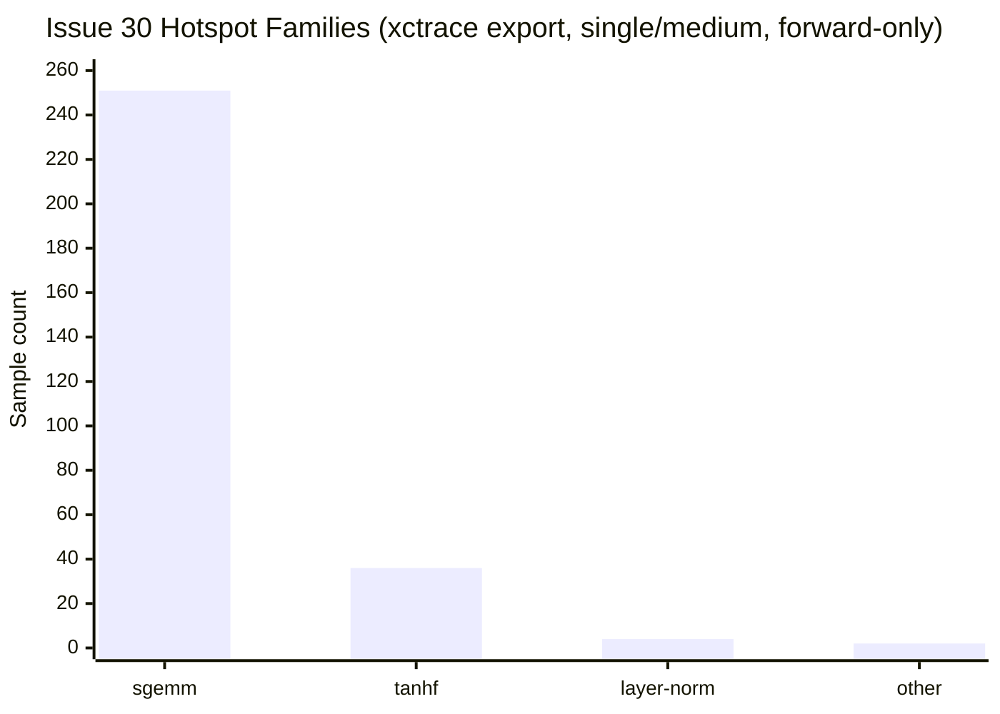
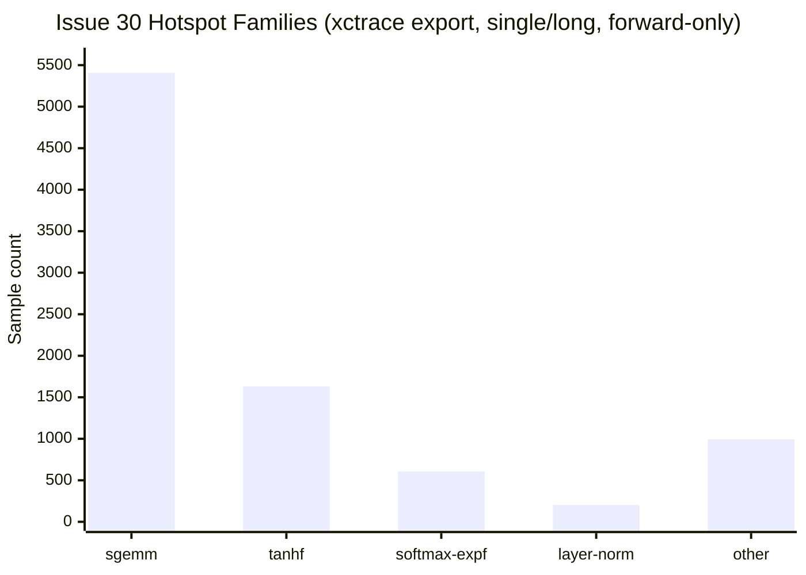
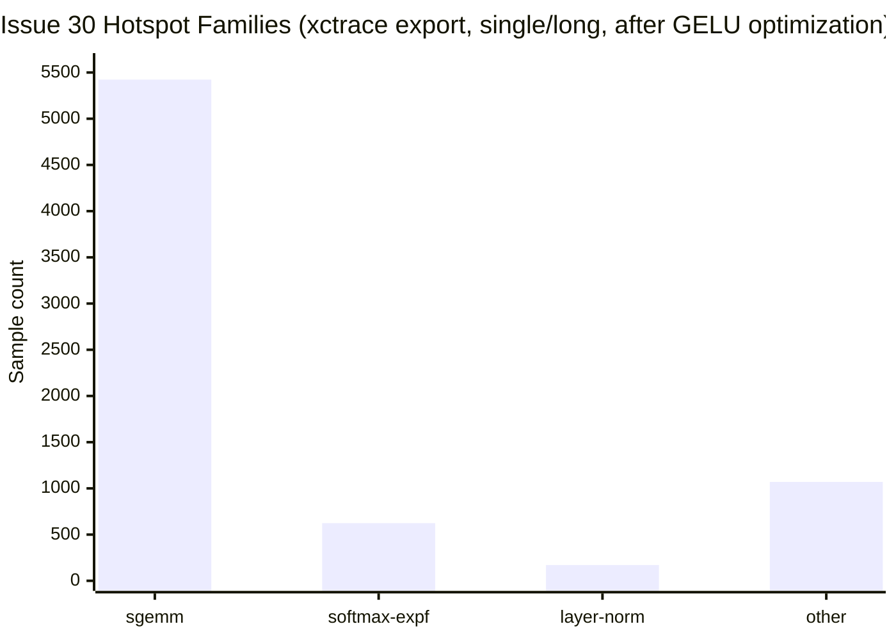
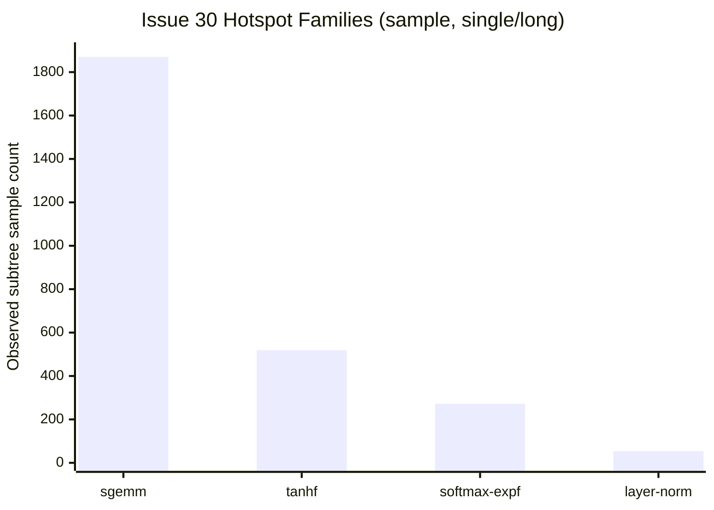

# Issue 30 Profiling Notes

## Scope

This note captures the reproducible profiling and benchmark workflow used for issue `#30` on macOS ARM64, plus the current hotspot summary after adding the fused masked-softmax path.

## Representative Commands

### Warm benchmark, all scenarios

Baseline workspace:

```bash
cargo run --release --bin benchmark_ltembed -- \
  --mode warm \
  --model-dir assets \
  --warmup 10 \
  --iters 30
```

Worktree under active development:

```bash
cargo run --release --bin benchmark_ltembed -- \
  --mode warm \
  --model-dir /Users/ruoshi/code/github/LTEmbed/assets \
  --warmup 10 \
  --iters 30
```

### Warm benchmark, single scenario

```bash
cargo run --release --bin benchmark_ltembed -- \
  --mode warm \
  --scenario single/medium \
  --model-dir /Users/ruoshi/code/github/LTEmbed/assets \
  --warmup 10 \
  --iters 30
```

This single-scenario mode is the new profiling-oriented entrypoint added in this change.

### Warm benchmark, mixed-length padded batch

```bash
cargo run --release --bin benchmark_ltembed -- \
  --mode warm \
  --scenario batch/mixed/8 \
  --model-dir /Users/ruoshi/code/github/LTEmbed/assets \
  --warmup 5 \
  --iters 20
```

This scenario intentionally mixes short, medium, and long texts in one batch so the engine has to exercise suffix-padding attention masks.

### Text hotspot summary with `sample`

```bash
target/release/benchmark_ltembed \
  --mode warm \
  --scenario single/long \
  --model-dir /Users/ruoshi/code/github/LTEmbed/assets \
  --warmup 5 \
  --iters 200 >/tmp/issue30-bench.json &

pid=$!
sample "$pid" 5 -mayDie -file /tmp/issue30-sample.txt
wait "$pid"
```

The `sample` output remains a useful fallback for longer runs and for text-first hotspot inspection.

### macOS `xctrace` trace artifact

Successful record:

```bash
xcrun xctrace record \
  --template 'Time Profiler' \
  --output /tmp/issue30-single-medium.trace \
  --time-limit 5s \
  --launch -- \
  target/release/benchmark_ltembed \
    --mode warm \
    --scenario single/medium \
    --model-dir /Users/ruoshi/code/github/LTEmbed/assets \
    --warmup 1 \
    --iters 10
```

Successful export:

```bash
xcrun xctrace export \
  --input /tmp/issue30-single-medium.trace \
  --xpath '/trace-toc/run[@number="1"]/data/table[@schema="time-profile"]' \
  --output /tmp/issue30-single-medium-time-profile.xml
```

Artifacts:

- trace bundle: `/tmp/issue30-single-medium.trace`
- exported time-profile XML: `/tmp/issue30-single-medium-time-profile.xml`
- long-run `sample` fallback: `/tmp/issue30-sample.txt`
- long-run benchmark JSON: `/tmp/issue30-bench.json`

## Current Benchmark Evidence

The main comparison from the full warm run:

| Scenario | Baseline mean ms | Current mean ms | Delta |
|---|---:|---:|---:|
| `single/long` | 296.349 | 290.976 | `-1.81%` |
| `single/medium` | 23.666 | 23.877 | `+0.89%` |
| `batch/medium/8` | 105.074 | 113.437 | noisy / regressed in this run |

Interpretation:

- the fused masked-softmax change shows a measurable win on the longer sequence path where attention score post-processing is amplified
- the shorter and batched scenarios were noisier on this machine and should be re-measured on a quieter runner before making stronger claims

## Hotspot Summary

### `xctrace` export: `single/medium`

The `issue30-single-medium.trace` export was aggregated twice:

- all trace samples
- `forward`-only samples whose stack contains `ltembed::models::bert::Bert::forward`

The `forward`-only view is the one that maps best to issue `#30`.

| Rank | Leaf hotspot | Samples | Share of `forward` samples | Interpretation |
|---|---|---:|---:|---|
| 1 | `matrixmultiply::gemm::gemm_loop` | 118 | 40.3% | dense projection and attention/value matmul orchestration |
| 2 | `matrixmultiply::sgemm_kernel::kernel_target_neon` | 83 | 28.3% | NEON micro-kernel compute |
| 3 | `matrixmultiply::gemm::masked_kernel` | 49 | 16.7% | matrixmultiply internal masked tail handling |
| 4 | `tanhf` | 34 | 11.6% | GELU scalar activation cost |
| 5 | `ltembed::models::bert::layer_norm_rows` | 4 | 1.4% | remaining row-wise scalar normalization |

Family summary for the `forward`-only export (`293` samples total):

| Family | Samples | Share |
|---|---:|---:|
| `sgemm` | 251 | 85.7% |
| `tanhf` | 36 | 12.3% |
| `layer-norm` | 4 | 1.4% |
| `other` | 2 | 0.7% |

Interpretation:

- on the `single/medium` trace, the dominant cost is still dense GEMM work, not scalar softmax
- `tanhf` is the clearest remaining scalar hotspot in this shorter scenario
- `layer_norm_rows` still appears, but at much lower weight
- the fused masked-softmax path does not surface as a top leaf in this medium-length trace, which is consistent with the expectation that scalar attention overhead is easier to see on longer sequences

### Chart: `xctrace` forward-only families



### `xctrace` export: `single/long`

To amplify the remaining scalar attention work, a second trace was recorded on `single/long`:

```bash
xcrun xctrace record \
  --template 'Time Profiler' \
  --output /tmp/issue30-single-long.trace \
  --time-limit 12s \
  --launch -- \
  target/release/benchmark_ltembed \
    --mode warm \
    --scenario single/long \
    --model-dir /Users/ruoshi/code/github/LTEmbed/assets \
    --warmup 1 \
    --iters 30
```

and exported with:

```bash
xcrun xctrace export \
  --input /tmp/issue30-single-long.trace \
  --xpath '/trace-toc/run[@number="1"]/data/table[@schema="time-profile"]' \
  --output /tmp/issue30-single-long-time-profile.xml
```

Forward-only summary (`8841` samples total):

| Family | Samples | Share |
|---|---:|---:|
| `sgemm` | 5407 | 61.2% |
| `tanhf` | 1631 | 18.4% |
| `softmax-expf` | 606 | 6.9% |
| `layer-norm` | 202 | 2.3% |
| `other` | 995 | 11.3% |

Top leaf hotspots:

| Rank | Leaf hotspot | Samples | Share of `forward` samples | Interpretation |
|---|---|---:|---:|---|
| 1 | `matrixmultiply::sgemm_kernel::kernel_target_neon` | 4755 | 53.8% | dominant dense compute |
| 2 | `tanhf` | 1581 | 17.9% | GELU scalar activation |
| 3 | `Bert::forward` internal scalar work | 919 | 10.4% | loop bodies not fully symbol-split by Instruments |
| 4 | `matrixmultiply::gemm::gemm_loop` | 649 | 7.3% | GEMM orchestration |
| 5 | `expf` | 424 | 4.8% | softmax exponentiation on the attention path |
| 6 | `layer_norm_rows` | 202 | 2.3% | row-wise normalization |

Interpretation:

- on the long sequence trace, `expf` finally shows up clearly as a top scalar leaf
- this confirms the original issue framing: after the earlier batching and mmap work, scalar kernels around softmax and normalization are still visible costs
- the fused `masked_softmax` path did not remove `expf` itself, but it did reduce surrounding extra passes over the attention-score rows

### Chart: `xctrace` forward-only families, `single/long`



## Follow-up: GELU optimization pass

After the profiling above identified `tanhf` as the clearest remaining scalar hotspot, `gelu` was updated to use a high-accuracy rational `fast_tanh` approximation instead of the libm `tanhf` call.

### Benchmark comparison vs. previous commit (`3ac842f`)

| Scenario | Before mean ms | After mean ms | Delta |
|---|---:|---:|---:|
| `single/medium` | 24.012 | 21.187 | `-11.77%` |
| `single/long` | 294.194 | 241.441 | `-17.93%` |

### `xctrace` follow-up: `single/long`

Forward-only family summary before vs. after the GELU change:

| Family | Before samples | After samples | Delta |
|---|---:|---:|---:|
| `sgemm` | 5407 | 5423 | `+0.3%` |
| `tanhf` | 1631 | 0 | `-100%` |
| `softmax-expf` | 606 | 624 | `+3.0%` |
| `layer-norm` | 202 | 171 | `-15.3%` |
| `other` | 995 | 1070 | `+7.5%` |

Interpretation:

- the `tanhf` hotspot was effectively removed from the `single/long` forward trace
- after eliminating GELU’s libm call, `softmax-expf` becomes more visible as the next scalar attention hotspot
- dense GEMM remains the dominant cost center overall

### Chart: `single/long` after GELU optimization



## Follow-up: suffix-padding softmax fast path

After the GELU work, the next scalar optimization pass targeted the common BERT padding layout where `attention_mask` is a contiguous `1*0*` prefix. The new logic classifies the mask once per input or batch row and then:

- uses plain softmax for the all-active case
- uses an active-prefix softmax for suffix-padded rows
- falls back to the generic masked path for non-contiguous masks

### Benchmark comparison vs. previous commit (`3e98e69`)

The relevant benchmark for this change is a new mixed-length batch scenario that actually produces suffix padding inside `forward_batch`.

| Scenario | Before mean ms | After mean ms | Delta |
|---|---:|---:|---:|
| `batch/mixed/8` | 1835.336 | 1720.750 | `-6.24%` |

Notes:

- `single/medium` and `single/long` stayed roughly neutral in local runs, which is expected because those scenarios do not contain suffix padding
- the mixed-length batched case is the one that meaningfully exercises the new fast path

### `sample` fallback: `single/long`

`sample` on `single/long` still shows that the dominant time remains in BERT forward compute, with the biggest families being:

| Rank | Hotspot family | Evidence from `/tmp/issue30-sample.txt` | Interpretation |
|---|---|---|---|
| 1 | `matrixmultiply::sgemm_kernel::kernel_target_neon` | repeated under multiple `Bert::forward` subtrees such as `+6336`, `+6924`, `+5416`, `+3104`, `+2628` | dense projections and attention/value matmuls remain the largest compute bucket |
| 2 | `tanhf` | strongest scalar leaf under `Bert::forward +6684` | GELU remains a major scalar cost |
| 3 | `expf` in the attention score path | visible under `Bert::forward +4372`, `+4452`, `+4480`, `+4544`, `+4580`, `+4608` | masked softmax is still a real scalar hotspot, but now handled in one fused row pass |
| 4 | `ltembed::models::bert::layer_norm_rows` | visible under `Bert::forward +6116` and `+7624` | layer norm still appears as a remaining scalar cleanup target |

### Hotspot Chart

The chart below uses representative subtree sample counts from the `sample` report. These counts are not exclusive percentages; they are a quick way to rank hotspot families from the text profile.



## Code Change Tied To This Profiling Pass

The optimization landed in [`src/models/bert.rs`](/Users/ruoshi/code/github/LTEmbed/.worktrees/issue-30-scalar-hotspots/src/models/bert.rs):

- added `masked_softmax`
- removed the separate column-wise padding-mask write loop
- normalized each attention row while zeroing masked positions in the same helper
- reused the helper in both `Bert::forward` and `Bert::forward_batch`

This reduces passes over the attention score rows and is the code change associated with the `single/long` improvement above.
